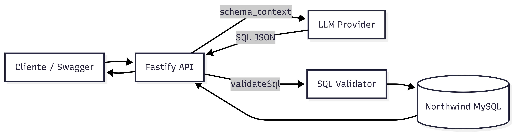

# FinTechX LLM-to-SQL API

API que converte perguntas em linguagem natural em SQL seguro (MySQL), valida e executa consultas de forma controlada. Projetada para acelerar análises e apoiar decisões na FinTechX com explicações e métricas de performance.

## Visão geral

- Entrada: pergunta em linguagem natural.
- Saída: SQL validado + resultados (opcional) + explicação.
- Segurança: SELECT-only, blocklist, whitelist de tabelas e limite automático.
- Observabilidade: tempo do LLM e do banco separados (`llm_ms`, `db_ms`).
- Saída estruturada com **function calling** quando suportado (fallback para JSON).
- Cache semântico simples para reaproveitar respostas por pergunta semelhante.

## Arquitetura



## Stack

- Node.js + TypeScript
- Fastify + Swagger UI
- MySQL (Northwind)
- LLM provider compatível com OpenAI (ex.: Groq)
  - Quando o provider suporta tool calling, a resposta é estruturada via função.

## LLM output estruturado

Quando o provider aceita function/tool calling, a resposta vem como JSON estruturado.
Se o provider falhar em tool calling, a API faz fallback para parsing de JSON no conteúdo.

## Setup

1. Instalar dependências:

```
npm install
```

2. Criar `.env`:

```
PORT=3000

DB_HOST=...
DB_PORT=3306
DB_USER=...
DB_PASSWORD=...
DB_NAME=northwind

LLM_API_KEY=...
LLM_BASE_URL=https://api.groq.com/openai/v1
LLM_MODEL=llama-3.1-8b-instant
```

3. Rodar em desenvolvimento:

```
npm run dev
```

4. Build e execução:

```
npm run build
npm start
```

Swagger UI:

```
http://localhost:3000/docs
```

Vercel (produção):

```
https://fintechx-llm-api.vercel.app/docs
```

Nota: no Vercel a API roda como Serverless Function (roteada por `/api` via `vercel.json`).

## Endpoints

- `GET /health`
  Health check simples.

- `GET /v1/meta/schema`
  Retorna tabelas/colunas do banco (cacheado).

- `GET /v1/demo/top-products`
  Demo: top 10 produtos mais caros.

- `POST /v1/ask`
  Gera SQL via LLM, valida e (opcionalmente) executa.
  Parâmetros:
  - `question` (string, obrigatório)
  - `execute` (boolean, default `true`)
  - `debug` (boolean, default `false`)

- `POST /v1/sql/validate`
  Valida SQL (SELECT-only).

- `POST /v1/query`
  Executa SQL validado.

## Exemplos (cURL)

1. Auditoria (gera SQL, não executa):

```
curl -X POST http://127.0.0.1:3000/v1/ask \
  -H "content-type: application/json" \
  -d '{"question":"Quais são os produtos mais caros?", "execute": false}'
```

2. Produtos mais vendidos:

```
curl -X POST http://127.0.0.1:3000/v1/ask \
  -H "content-type: application/json" \
  -d '{"question":"Quais são os produtos mais vendidos em termos de quantidade?"}'
```

3. Ticket médio:

```
curl -X POST http://127.0.0.1:3000/v1/ask \
  -H "content-type: application/json" \
  -d '{"question":"Qual o ticket médio por compra?"}'
```

4. Vendas por cidade:

```
curl -X POST http://127.0.0.1:3000/v1/ask \
  -H "content-type: application/json" \
  -d '{"question":"Qual é o volume de vendas por cidade? Mostre top 10."}'
```

5. SQL direto (validado):

```
curl -X POST http://127.0.0.1:3000/v1/query \
  -H "content-type: application/json" \
  -d '{"sql":"SELECT * FROM products"}'
```

## Regras de segurança (resumo)

- Apenas `SELECT`.
- Blocklist: `insert`, `update`, `delete`, `drop`, `alter`, `truncate`, `call`, `information_schema`, `sleep`, etc.
- Whitelist de tabelas via schema real.
- `LIMIT` automático quando ausente (`200`) e cap máximo (`500`).

## Cache semântico

- Cache em memória (TTL padrão: 5 minutos, máx. 200 entradas).
- Chave baseada na pergunta normalizada + flags `execute`/`debug`.
- Em cache hit, a resposta inclui `cache: { hit: true, age_ms }`.

## Observabilidade

Todas as respostas de `/v1/ask` expõem:

- `llm_ms`: latência do LLM.
- `db_ms`: latência do banco (quando `execute=true`).

Logs estruturados incluem `request_id`, latências e quantidade de linhas.

## Notas sobre o schema

Este projeto usa um Northwind modernizado. Ex.: `products.product_name`, `products.list_price`, `orders.ship_city`, `order_details.unit_price`.

## Como validar rapidamente

1. Health:

```
curl http://127.0.0.1:3000/health
```

2. Segurança:

```
curl -X POST http://127.0.0.1:3000/v1/query \
  -H "content-type: application/json" \
  -d '{"sql":"DELETE FROM products"}'
```

3. Debug:

```
curl -X POST http://127.0.0.1:3000/v1/ask \
  -H "content-type: application/json" \
  -d '{"question":"Produtos mais caros", "debug": true}'
```
